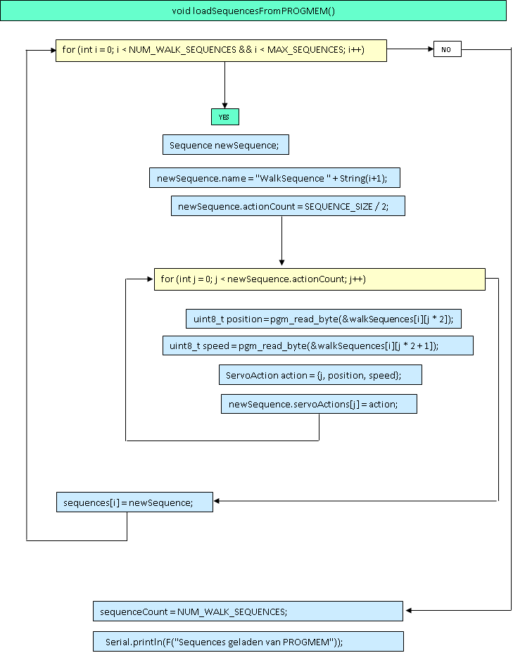

this repository is for practicing.
to make a GUI in visual studio  C++/CLI to control servo's with arduino nano every and PCA9685 servo controller and HC-05 bluetooth.
Je ziet eerst de code waar mee begonnen is. Deze is makkelijker te begrijpen.
Daarna optimaliseren we de code en leggen uit waarom e.e.a. een verbetering is.

- [x] #739
- [ ] https://github.com/octo-org/octo-repo/issues/740
- [ ] Add delight to the experience when all tasks are complete :tada:


# Arduino Nano PCA9685_HC-05 Servo Controller

Dit programma is ontworpen voor gebruik met de **Evolutronics-robotics GUI servo-controller**. Het biedt een uitgebreide set functies om servo's aan te sturen, posities op te slaan als sequenties, en deze sequenties af te spelen. De sequenties kunnen ook in het PROGMEM van de Arduino worden geplaatst om standalone of via Bluetooth te worden afgespeeld. 

De volledige programmering is uitvoerig gedocumenteerd, waardoor het eenvoudig is om het programma verder te verbeteren of uit te breiden.

---

## Functionaliteiten

### Hoofdfuncties:
- **Servo-aansturing via GUI:** 
  Een serial command vanuit de GUI stuurt een specifieke servo naar de gewenste positie.
- **Sequentiebeheer:**
  - Posities kunnen worden opgeslagen als sequenties in een array.
  - Sequenties kunnen direct worden afgespeeld.
  - Stoppen van een sequentie-afspeelactie op elk moment.
- **Standalone sequentiebeheer via PROGMEM:**
  - Vanwege de beperkte geheugenruimte van de Arduino Nano worden sequenties opgeslagen in PROGMEM.
  - Deze sequenties kunnen standalone of via Bluetooth worden afgespeeld.
- **Bluetooth-functionaliteit:**
  - Met een HC-05 module kan de Arduino Nano ook zonder USB-aansluiting worden bediend.
  - Sequenties opgeslagen in PROGMEM kunnen via Bluetooth worden aangestuurd.

---

## Beschrijving van het proces

### Communicatie via de GUI:
1. De GUI stuurt een serial command naar de Arduino Nano.
2. De Arduino leest het command en voert de bijbehorende actie uit:
   - **SLIDE:** Een slider in de GUI stuurt de geselecteerde servo naar een specifieke positie via de PCA9685.
   - **SEQ_SAVE:** Sequenties van servo-posities worden opgeslagen in een array.
   - **PLAY:** De opgeslagen sequenties in de array worden afgespeeld.
   - **STOP:** Het afspelen van sequenties wordt direct gestopt.
   - **PROG:** Sequenties uit PROGMEM worden afgespeeld.

### Bluetooth-functionaliteit:
- De **HC-05 Bluetooth-module** maakt draadloze communicatie mogelijk.
- Sequenties opgeslagen in PROGMEM kunnen via Bluetooth worden afgespeeld, zodat de Arduino Nano ook zonder USB-verbinding kan worden gebruikt.

---

## Programma-architectuur

Het programma is opgesplitst in verschillende modules, elk verantwoordelijk voor een specifieke taak:

1. **Serial Module:**
   - Verantwoordelijk voor het ontvangen en verwerken van serial data.
   - Bepaalt welk command wordt uitgevoerd.
2. **Command Modules:**
   - **SEQ_SAVE:** Beheert het opslaan van sequenties.
   - **PLAY:** Zorgt voor het afspelen van sequenties uit een array.
   - **STOP:** Stopt onmiddellijk het afspelen van sequenties.
   - **SLIDE:** Aansturing van servo's via de GUI-slider.
   - **GROUP:** Verantwoordelijk voor het afspelen van PROGMEM-sequenties via serial of Bluetooth.

---

## Toekomstige uitbreidingen

Dit programma is ontwikkeld met het oog op flexibiliteit en uitbreidbaarheid. Nieuwe functies kunnen eenvoudig worden toegevoegd, zoals:
- Groepsbeheer voor sequenties.
- Geavanceerdere Bluetooth-commando's.
- Meer optimalisaties voor geheugengebruik.

---

Met dit programma biedt de **Arduino Nano PCA9685_HC-05 Servo Controller** een krachtige en veelzijdige oplossing voor servo- en robotica-projecten.


# Receiving Data

De data wordt karakter voor karakter binnengehaald, en bewaard in een variable inputBuffer.
De data zal dan doorgetuurd worden naar een parser om de data te ontleden.


### C++ Code

```cpp
  while (Serial.available()) {
    char received = Serial.read();
    if (received == '>') {
      inputBuffer += received;
      commandHandler.processCommand(inputBuffer);
      inputBuffer = "";
    } else if (received == '<') {
      inputBuffer = "<";
    } else {
      inputBuffer += received;
      
    }
  }

```


# Serial Data Parsing

Serial data wordt naar de Arduino gestuurd om ermee te communiceren.
De Arduino ontvangt deze data en moet begrijpen wat ermee moet gebeuren.
Om dit proces eenvoudiger en gestructureerd te maken, gebruiken we een protocol.
In dit protocol spreken we af welke vorm de serial data heeft en wat de betekenis ervan is.

Een protocol bestaat uit een commando gevolgd door de bijbehorende data.
Wanneer de Arduino een commando ontvangt,
weet deze welke actie uitgevoerd moet worden en hoe de bijgeleverde data gebruikt moet worden.

## Protocol Structuur

Het protocol heeft de volgende vorm:


Enkele voorbeelden van commando's:

- `<SEQ_SAVE,walk,180,10,90,8,10,20,80,5,90,8,180,25,45,15,120,8,10,20,180,10,90,60,2>`
- `<PLAY>`
- `<STOP>`
- `<SLIDE,1,45>`
- `<SEQ_PROG,3>`

## Werking van het Protocol

De Arduino leest elk ontvangen karakter van de serial data één voor één. Zodra het teken `<` wordt gedetecteerd,
weet de Arduino dat een nieuw commando begint.
De karakters die daarna volgen, worden opgeslagen in een buffer
(bijvoorbeeld een `String inputBuffer`) totdat het teken `>` wordt gevonden.
Dit teken markeert het einde van het commando.

De opgeslagen string wordt vervolgens verwerkt. Dit gebeurt als volgt:

1. Het eerste deel van de string (vóór de eerste komma) wordt opgeslagen als het **mainCommand**.
2.  Dit bepaalt welke functie de Arduino moet uitvoeren.
3. Het resterende deel van de string (alles na de eerste komma) wordt opgeslagen als **parameters**.
4.  Deze data wordt doorgegeven aan de functie die door het commando wordt opgeroepen.

## Voorbeeldverwerking

Bijvoorbeeld, als de string `<SLIDE,1,45>` wordt ontvangen:

- Het **mainCommand** is: `SLIDE`.
- De **parameters** zijn: `1,45`.

De Arduino roept vervolgens de functie aan die hoort bij het commando `SLIDE`,
en deze functie verwerkt de parameters (in dit geval: **servo 1 bewegen naar positie 45 graden**).


### C++ Code

```cpp
void processCommand(String command) {
    if (command.length() < 3) return;
    command = command.substring(1, command.length() - 1);

    int firstComma = command.indexOf(',');
    String mainCommand = (firstComma != -1) ? command.substring(0, firstComma) : command;
    String parameters = (firstComma != -1) ? command.substring(firstComma + 1) : "";

    if (mainCommand == "SEQ_SAVE") {
      Serial.println(F("seq ontvangen"));
      processSeqSave(parameters);
       } else if (mainCommand == "SEQ_PROG") {
        uint8_t sequencesToLoad = parameters.toInt();
        if (sequencesToLoad <= 0 || sequencesToLoad > NUM_WALK_SEQUENCES) {
            Serial.println(F("Ongeldig aantal sequences!"));
        } else {
            processSeqProg(sequencesToLoad); // Roep processSeqProg aan
        }
    } else if (mainCommand == "PLAY") {
        currentState = PLAY_SEQUENCE;
        stateChangeTime = millis(); // Reset de timer
    } else if (mainCommand == "SLIDE") {
        slider(parameters); // Nieuwe functie om te stoppen      
    } else if (mainCommand == "STOP") {
        stopSequence(); // Nieuwe functie om te stoppen  
    } else {
      Serial.println("Onbekend commando!");
    }
  }


```

### Command Processing: `SEQ_SAVE`

Daarna zal gekeken worden wat het `mainCommand` is en verder doorgestuurd worden naar de bijbehorende functie.

We kijken nu naar elk command, beginnend bij `SEQ_SAVE`.

# Opslaan van Servo Posities en Snelheden met Structs

Om de bewegingen van meerdere servo's te beheren, gebruiken we **structs** om gegevens gestructureerd op te slaan. Er zijn twee hoofdstructuren:

1. **ServoAction**: Bewaart de instellingen van één servo-actie (welke servo, welke positie en snelheid).
2. **Sequence**: Bevat een reeks van **ServoActions** voor alle servo's, waarmee een volledige beweging wordt gedefinieerd.

Daarnaast houden we een array bij waarin meerdere sequences kunnen worden opgeslagen, zodat we verschillende bewegingen kunnen combineren en herhalen.

---

## Structuur voor een enkele Servo-actie  

Elke servo-actie bevat drie belangrijke waarden:

- **servoId**: Het ID van de servo die bewogen moet worden (bijv. 0 t/m 10 voor 11 servo's).
- **position**: De gewenste positie van de servo (bijv. 0-180 graden).
- **speed**: De snelheid waarmee de servo naar die positie beweegt.

Hier is de definitie van de `ServoAction` struct:
### C++ Code

```cpp
struct ServoAction {
  uint8_t servoId;  // Servo nummer (0-10)
  uint8_t position; // Positie in graden (0-180)
  uint8_t speed;    // Snelheid van de beweging
};


### C++ Code

```cpp
// Structuur voor een enkele Servo-actie
struct ServoAction {
  uint8_t servoId;
  uint8_t position;
  uint8_t speed;
};

// Structuur voor een Sequence
struct Sequence {
  String name;
  ServoAction servoActions[11]; // Maximaal 11 servos per sequence
  uint8_t actionCount;             // Aantal acties in deze sequence
};

// Maximaal aantal sequences
#define MAX_SEQUENCES 16
Sequence sequences[MAX_SEQUENCES];
uint8_t sequenceCount = 0; // Huidig aantal opgeslagen sequences

```


Het roept de functie `processSeqSave(String parameters)` aan. Deze functie werkt als volgt:

1. Controleert of het maximale aantal sequences is bereikt.  
   - Als dit het geval is, keert de functie terug.
2. Zo niet, dan zal de functie:
   - De string scheiden in de naam van de sequence en de rest van de string.
   - De `actionCount` resetten naar `0`.
3. Vervolgens controleert de functie:
   - Of `actionCount` kleiner is dan `12`.
   - En of de stringlengte groter is dan `0`.
4. Indien beide voorwaarden waar zijn:
   - Wordt de eerste positie en snelheid (`speed`) uit de string gehaald.
   - Deze waarden worden opgeslagen in `action[actionCount]` (positie en snelheid).
   - De `actionCount` wordt verhoogd.
   - De functie begint opnieuw, totdat de string leeg is **of** `actionCount > 12`.
5. Als de string leeg is of de limiet is bereikt:
   - Wordt de `sequenceCount` verhoogd.
   - En de functie begint met de volgende sequence.
   - 

### C++ Code

```cpp
  void processSeqSave(String parameters) {
    if (sequenceCount >= MAX_SEQUENCES) return;
Serial.println(F("in save"));
    int firstComma = parameters.indexOf(',');
    if (firstComma == -1) return;

    String sequenceName = parameters.substring(0, firstComma);
    parameters = parameters.substring(firstComma + 1);

    Sequence newSequence;
    newSequence.name = sequenceName;
    newSequence.actionCount = 0;

    while (parameters.length() > 0 && newSequence.actionCount < 12) {
      uint8_t commaIndex1 = parameters.indexOf(',');
      if (commaIndex1 == -1) break;
      uint8_t position = parameters.substring(0, commaIndex1).toInt();
      parameters = parameters.substring(commaIndex1 + 1);

      uint8_t commaIndex2 = parameters.indexOf(',');
      uint8_t speed;
      if (commaIndex2 != -1) {
        speed = parameters.substring(0, commaIndex2).toInt();
        parameters = parameters.substring(commaIndex2 + 1);
      } else {
        speed = parameters.toInt();
        parameters = "";
      }

      ServoAction action = {newSequence.actionCount, position, speed};
      newSequence.servoActions[newSequence.actionCount] = action;
      newSequence.actionCount++;
    }

    sequences[sequenceCount] = newSequence;
    sequenceCount++;
  }

```


## 🚀 PLAY Commando - Servo Bewegingsbesturing  
### 🕹 State Machine Switch
Het **PLAY**-commando start de **State Machine** en activeert de bewegingssequenties van de servo's.  

Wanneer het commando `PLAY` wordt ontvangen:  
1. De state machine wordt opgestart in `loop()`.  
2. De **currentState** wordt gewijzigd naar `PLAY_SEQUENCE`.  
3. De timer wordt gereset met:
 
### C++ Code

   ```cpp
   stateChangeTime = millis(); // Reset de timer
  ```

4. Alle servo's worden naar hun eindpositie gebracht met:

### C++ Code

 ```cpp
    servos[i].Update();
  ```

5. De functie playSequence(currentSequence); wordt aangeroepen, die:

De posities en snelheden van de servo’s bijwerkt.
Controleert of alle servo’s hun eindpositie hebben bereikt.
Als alle servo's hun eindpositie hebben bereikt, wordt de teller verhoogd en start de volgende sequence.
# 🔧 Structuur van de Servo State Machine
Elke servo wordt beheerd door een StateMachine-klasse die de positie en snelheid regelt.

# ⚙️ Definiëren van Servo's
We gebruiken een array om maximaal 11 servo's op te slaan:

### C++ Code

 ```cpp
    #define NUM_SERVOS 11

StateMachine servos[NUM_SERVOS] = {
  StateMachine(0, 20), StateMachine(1, 20), StateMachine(2, 20),
  StateMachine(3, 20), StateMachine(4, 20), StateMachine(5, 20),
  StateMachine(6, 20), StateMachine(7, 20), StateMachine(8, 20),
  StateMachine(9, 20), StateMachine(10, 20)
};
  ```
Elke servo wordt geïnitialiseerd en krijgt een doelpositie en snelheid:

### C++ Code

 ```cpp
    for (int i = 0; i < NUM_SERVOS; i++) {
      servos[i].setTargetPosition(90, 10);
      servos[i].Update();
    }
  ```

# 🔄 State Machine in de Loop
De State Machine zorgt ervoor dat de servo's continu worden bijgewerkt:

### C++ Code

 ```cpp
    switch (currentState) {
      case PLAY_SEQUENCE:
        for (uint8_t i = 0; i < NUM_SERVOS; i++) {
          servos[i].Update();
        }
    
        if (allServosAtTarget()) {
          currentSequence = (currentSequence + 1) % sequenceCount;
          playSequence(currentSequence);
        }
        break;
    
      default:
        break;
    }
  ```

# 🏗️ StateMachine Klasse
De StateMachine-klasse regelt de beweging van elke individuele servo:

### C++ Code

 ```cpp
    class StateMachine {
  uint8_t servoChannel;
  uint8_t currentPosition;
  uint8_t targetPosition;
  uint8_t increment;
  uint8_t updateInterval;
  unsigned long lastUpdate;

public:
  StateMachine(int channel, int interval) {
    servoChannel = channel;
    updateInterval = interval;
    increment = 1;
    currentPosition = 90;  // Startpositie
    targetPosition = 90;   // Startpositie
    lastUpdate = 0;
  }

  void Update() {
    if ((millis() - lastUpdate) > updateInterval) {
      lastUpdate = millis();

      if (currentPosition < targetPosition) {
        currentPosition += increment;
        if (currentPosition > targetPosition) currentPosition = targetPosition;
      } else if (currentPosition > targetPosition) {
        currentPosition -= increment;
        if (currentPosition < targetPosition) currentPosition = targetPosition;
      }

      pwm.setPWM(servoChannel, 0, angleToPWM(currentPosition));
    }
  }

  void setTargetPosition(int position, int speed) {
    targetPosition = position;
    increment = speed > 0 ? speed : 1;  // Zorg dat de snelheid positief is
  }

  bool isAtTarget() {
    return currentPosition == targetPosition;
  }

  uint8_t getCurrentPosition() const {
    return currentPosition;
  }
};
  ```

## ✅ Controleren of Alle Servo's Op Hun Doelpositie Zijn

### C++ Code

 ```cpp
    bool allServosAtTarget() {
  for (uint8_t i = 0; i < NUM_SERVOS; i++) {
    if (!servos[i].isAtTarget()) {
      return false;
    }
  }
  return true;
}
  ```

# 🎬 Starten van een Sequence
Wanneer een nieuwe sequence wordt gestart, worden de posities en snelheden van de servo's ingesteld:

### C++ Code

 ```cpp
    void playSequence(uint8_t sequenceIndex) {
  Sequence sequence = sequences[sequenceIndex];
  for (uint8_t i = 0; i < sequence.actionCount; i++) {
    ServoAction action = sequence.servoActions[i];
    servos[action.servoId].setTargetPosition(action.position, action.speed);
  }
}
  ```

# 🎛 Commando: SLIDE, servoId, positie
Met het SLIDE-commando kunnen we een servo direct naar een specifieke positie sturen. Dit commando wordt vaak gebruikt wanneer:
✅ Een slider in de GUI wordt bewogen.
✅ De positie handmatig wordt ingevoerd in een seriële monitor.

📌 Gebruik van het SLIDE-commando


### C++ Code

 ```cpp
SLIDE, servoId, positie
  ```
servoId → Het ID-nummer van de servo (bijv. 0 t/m 10 voor 11 servo's).
positie → De gewenste positie in graden (0-180).
🎯 Voorbeeld

 ```cpp
SLIDE, 3, 90
  ```

🚀 Dit zal servo 3 direct verplaatsen naar 90 graden.

# 🛠 Implementatie in C++
Hier is de functie die het SLIDE-commando verwerkt:

### C++ Code

 ```cpp
void slider(String parameters) {
    // Splits de parameters op basis van een komma
    int commaIndex = parameters.indexOf(',');
    if (commaIndex == -1) {
        Serial.println("⚠️ Fout: Onjuiste SLIDER parameters.");
        return;
    }

    // Haal de servo ID en de gewenste positie uit de parameters
    String servoIdStr = parameters.substring(0, commaIndex);
    String positionStr = parameters.substring(commaIndex + 1);

    // Zet de waarden om naar integers
    int servoId = servoIdStr.toInt();
    int position = positionStr.toInt();

    // Controleer of de servo ID geldig is
    if (servoId >= 0 && servoId < NUM_SERVOS) {
        // Converteer de positie naar PWM-ticks en stuur naar de PCA9685
        int ticks = angleToPWM(position);
        pwm.setPWM(servoId, 0, ticks);

        // Bevestiging naar de seriële monitor
        Serial.print("✅ Servo ");
        Serial.print(servoId);
        Serial.print(" ingesteld op ");
        Serial.print(position);
        Serial.println(" graden.");
    } else {
        Serial.println("❌ Fout: Ongeldig servo ID.");
    }
}

  ```
💾 Commando: PROGMEM, aantal_sequences
Met het PROGMEM-commando kunnen we bewegingssequenties uit het flash-geheugen laden.
Dit bespaart RAM-geheugen en zorgt ervoor dat we meerdere vooraf gedefinieerde loops
kunnen gebruiken zonder het programma te vertragen.

📌 Gebruik van het PROGMEM-commando

 ```cpp
PROGMEM, aantal_sequences
  ```

* aantal_sequences → Het aantal sequences dat geladen moet worden vanuit PROGMEM.

🎯 Voorbeeld

 ```cpp
PROGMEM, 3
  ```
🚀 Dit laadt de eerste 3 sequences uit het flash-geheugen en maakt ze beschikbaar voor gebruik.

🛠 Implementatie in C++
Hier is de functie die de sequences laadt uit PROGMEM:

 ```cpp
void loadSequencesFromProgmem(uint8_t sequencesToLoad) {
    sequenceCount = 0; // Reset huidige sequences
    for (uint8_t i = 0; i < sequencesToLoad && i < NUM_WALK_SEQUENCES; i++) {
        Sequence newSequence;
        newSequence.name = "PROGMEM_" + String(i); // Naam op basis van index
        newSequence.actionCount = SEQUENCE_SIZE / 2; // Elke sequence bevat positie/snelheid-paren

        for (int j = 0; j < SEQUENCE_SIZE; j += 2) {
            uint8_t position = pgm_read_byte(&walkSequences[i][j]);
            uint8_t speed = pgm_read_byte(&walkSequences[i][j + 1]);
            ServoAction action = {j / 2, position, speed};
            newSequence.servoActions[j / 2] = action;
        }

        sequences[sequenceCount++] = newSequence; // Toevoegen aan sequence-array
        if (sequenceCount >= MAX_SEQUENCES) break; // Voorkom overflow
    }

    Serial.print(F("✅ Succesvol "));
    Serial.print(sequencesToLoad);
    Serial.println(F(" sequences geladen uit PROGMEM!"));
}

  ```
📂 Hoe werkt het?
De functie reset de huidige sequences.
Leest de sequenties uit PROGMEM (flash-geheugen) en zet deze in een lijst.
Elke sequence bevat paren van positie en snelheid.
Controleert of de array niet over de limiet gaat.
Geeft een bevestigingsbericht op de seriële monitor.

🗂 Vooraf gedefinieerde sequences in PROGMEM


 ```cpp
#define SEQUENCE_SIZE 22 

const uint8_t walkSequences[][SEQUENCE_SIZE] PROGMEM = {
    {120, 5, 180, 6, 120, 6, 45, 10, 160, 10, 90, 5, 180, 6, 120, 6, 45, 10, 160, 10, 120, 20},
    {45, 5, 110, 6, 20, 6, 45, 10, 160, 10, 90, 5, 180, 6, 120, 6, 45, 10, 160, 10, 120, 20},
    {90, 5, 180, 6, 120, 6, 45, 10, 160, 10, 90, 5, 180, 6, 120, 6, 45, 10, 160, 10, 120, 20},
    {45, 5, 110, 6, 20, 6, 45, 10, 160, 10, 90, 5, 180, 6, 120, 6, 45, 10, 160, 10, 120, 20},

    // Voeg meer sequences toe indien nodig
};

  ```


😃

> [!NOTE]
> Useful information that users should know, even when skimming content.

> [!TIP]
> Helpful advice for doing things better or more easily.

> [!IMPORTANT]
> Key information users need to know to achieve their goal.

> [!WARNING]
> Urgent info that needs immediate user attention to avoid problems.

> [!CAUTION]
> Advises about risks or negative outcomes of certain actions.


